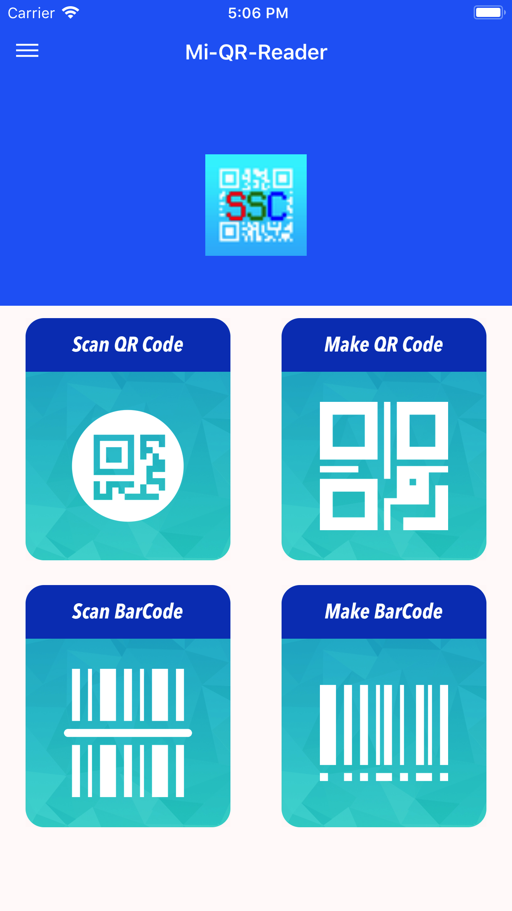

## Welcome to SSC-QrCodePlatform Pages

QR code (abbreviated from Quick Response Code) is the trademark for a type of matrix barcode (or two-dimensional barcode) first designed for the automotive industry in Japan. A barcode is a machine-readable optical label that contains information about the item to which it is attached. A QR code uses four standardized encoding modes (numeric, alphanumeric, byte/binary, and kanji) to efficiently store data; extensions may also be used.

The QR code system became popular outside the automotive industry due to its fast readability and greater storage capacity compared to standard UPC barcodes. Applications include product tracking, item identification, time tracking, document management, and general marketing.

A QR code consists of black squares arranged in a square grid on a white background, which can be read by an imaging device such as a camera, and processed using Reed–Solomon error correction until the image can be appropriately interpreted. The required data is then extracted from patterns that are present in both horizontal and vertical components of the image.

Sample QR Code

## screen

*Feature*

**1.Generate QR Code**

**2.Scan QR Code**

**3.Save QR Code**

### Support or Contact

support email: [luyunma@gmail.com](mailto:luyunma988@gmail.com)
